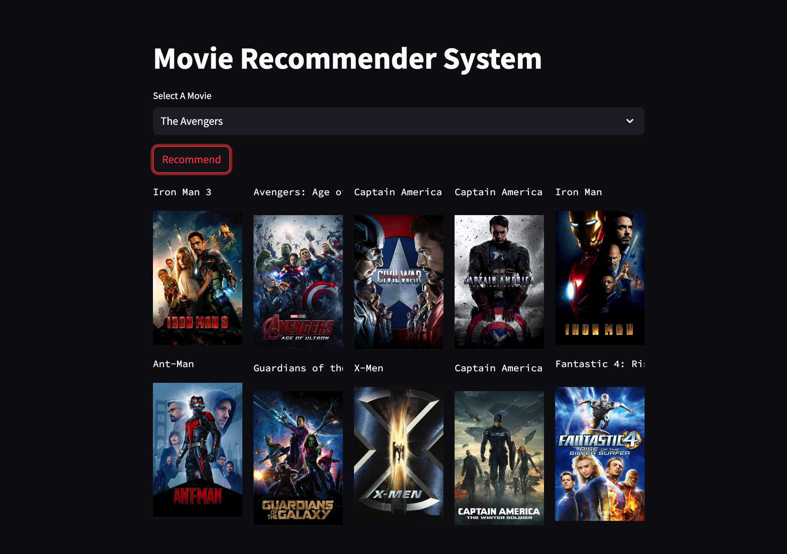
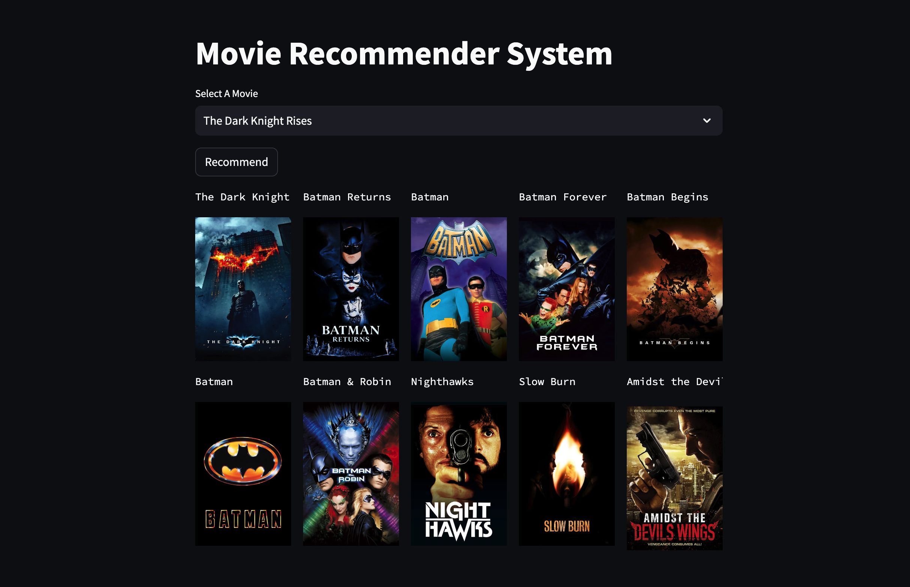

# Movie-Recommender-System

## Overview
This is a movie recommendation system built using machine learning techniques and Python. The system recommends movies to users based on their selected content preferences.

## Features
- Content-based recommendation: Users can select their preferred movie genres, actors, directors, and other criteria.
- Streamlit frontend: The system's user interface is built using Streamlit for an interactive experience.

## Technologies Used
- Python
- Machine learning libraries (e.g., nltk, pandas)
- Streamlit 

## Screenshots
Here are some screenshots of the movie recommendation system:

